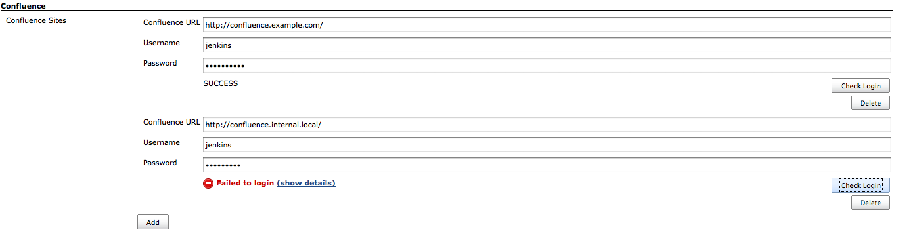
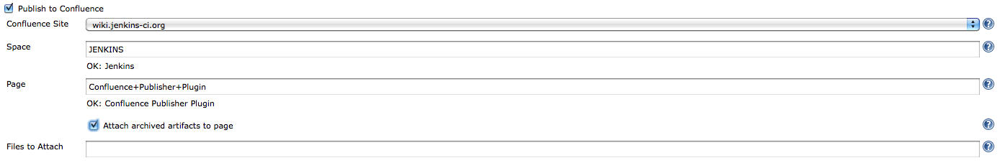
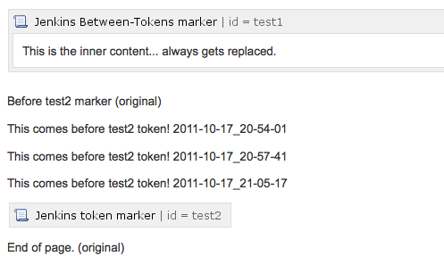

| Plugin Information                                                                                                    |
|-----------------------------------------------------------------------------------------------------------------------|
| View Confluence Publisher [on the plugin site](https://plugins.jenkins.io/confluence-publisher) for more information. |

# [Plugin distribution suspended](https://github.com/jenkins-infra/helpdesk/issues/3856)

Distribution of this plugin has been suspended by the Jenkins project because it uses several closed source dependencies.
The closed source dependencies in the most recent release include:

* `com.atlassian.confluence:confluence-java-api:7.14.0`
* `com.atlassian.confluence:confluence-rest-client:7.14.0`
* `com.atlassian.confluence:confluence-rest-serialization:7.14.0`
* `com.atlassian.confluence:confluence-rest-api:7.14.0`

The Jenkins project [governance document](https://www.jenkins.io/project/governance/#license) and the [plugin hosting instructions](https://www.jenkins.io/doc/developer/publishing/preparation/#license) both note that the Jenkins project requires that plugins distributed by the Jenkins project must be open source and use open source dependencies.

Older versions of this plugin may not be safe to use. Please review the
following warnings before using an older version:

-   [CSRF vulnerability and missing permission
    checks](https://jenkins.io/security/advisory/2018-07-30/#SECURITY-982)

This plugin allows you to publish build artifacts as attachments to an
[Atlassian](http://www.atlassian.com/)
[Confluence](http://www.atlassian.com/software/confluence/) wiki page.

## Configuration

### Global Configuration

First, configure one or more Confluence sites in the global system
configuration. If authentication credentials are not supplied, the
plugin will act as an anonymous user – as such your Confluence
configuration must support anonymous attachments for that to work.

{width="800"}

### Job Configuration

With at least one site configured, enable the "Publish to Confluence"
post-build action, and select from one of the pre-configured Confluence
sites. Enter the Space and Page name where the attachment should end up
(e.g., for this URL, Space name = "JENKINS", Page name =
"Confluence+Publisher+Plugin").

If you have enabled "Archive the artifacts", and wish to automatically
upload everything that was archived, check the box labeled "Attach
archived artifacts to page". *Otherwise*, enter an Ant-style fileset
pattern to specify which files should be uploaded.

{width="800"}

### Editing page markup

Please note that as of Confluence v4.0, the page storage format is no
longer supporting "wiki format". That makes it slightly more difficult
to use simple hidden macros for the replacements. It is still possible,
but at the moment it is a bit convoluted and fragile.

In the "Wiki Markup Replacements" section, select the Editor type from
the "Add Replacement" dropdown menu. Available Editors include:

-   **Entire Page**
    Entire page content is replaced. *No markers required.*
-   **Prepend**
    Content is added to the very beginning of the page. *No markers
    required.*
-   **Append**
    Content is added to the very end of the page. *No markers required.*
-   **Before Token**
    Content is inserted before a configurable marker token. *Requires
    one marker.*
-   **After Token**
    Content is inserted after a configurable marker token. *Requires one
    marker.*
-   **Between Tokens**
    Content is inserted between two configurable start/end marker
    tokens. Existing content between the tokens is replaced. *Requires a
    start and end marker.*

Once an editor has been selected, choose the type of markup Generator to
use. Available Generators:

-   **Plain Text**
    Content is entered into a textarea field. The content should be
    valid wiki markup. Build variables will be expanded.
-   **File Contents**
    Enter a filename to pull markup contents from. The file should exist
    relative to the workspace directory, and should contain plain-text
    markup. Build variables will be expanded.

You may add multiple markup replacement configurations. However, note
that the token-related editors only expect to perform edits once,
therefore each replacement configuration should use unique token
markers.

If possible, it is recommended to configure two custom User Macros in
the Confluence configuration (or have your Confluence administrator
configure them):

#### Sample Confluence 3.x User Macros

-   Single-marker macro (used for "Before Token" and "After Token"
    editors):
    -   Name: jenkins-marker
    -   `[ ]` Macro has a body (***uncheck** the box*)
    -   "Macro generates HTML markup"
    -   Template: *blank*
-   Start/End macro (used for the "Between Tokens" editor):
    -   Name: jenkins-between
    -   `[X]` Macro has a body
    -   "Use unprocessed macro body"
    -   "Macro generates wiki markup"
    -   Template: *blank*

These two macros can then be used in the wiki markup, and will not
interfere with normal rendering of the wiki content. Additionally,
Confluence's "parameter" syntax for user macros allows adding arbitrary
parameters to these macros, thus making it very simple to keep the
tokens unique. Some examples:

-   {`jenkins-marker:before|section=foo`}
-   {`jenkins-marker:after|section=changelog`}
-   {`jenkins-between:start|section=log}This will be replaced.{jenkins-between:end|section=log`}

If you choose not to use a confluence macro as the token, it will still
work (e.g., you can something else, like "`%%INSERT_AFTER%%`"). However,
that text may appear in the rendered markup. For that reason, using the
Confluence macro is the recommended approach.

#### Sample Confluence 4.x User Macros

-   Single-marker macro (used for "Before Token" and "After Token"
    editors):
    -   Name: jenkins-marker
    -   
        No Macro Body
    -   Template:

            ## Macro title: Jenkins Token Marker
            ## Macro has a body: N
            ## Body processing: No macro body
            ## Output: None
            ##
            ## Developed by: Joe Hansche
            ## Date created: 10/17/2011
            ## Installed by: Joe Hansche

            ## Allows an "id" parameter in order to make multiple unique markers
            ## @param id

-   Start/End macro (used for the "Between Tokens" editor):
    -   Name: jenkins-between
    -   
        Rendered
    -   Template:

            ## Macro title: Jenkins Between-Tokens section
            ## Macro has a body: Y
            ## Body processing: Rendered
            ## Output: Piped input
            ##
            ## Developed by: Joe Hansche
            ## Date created: 10/17/2011
            ## Installed by: Joe Hansche

            ## Allows an "id" parameter in order to make multiple unique markers
            ## @param id
            $body

It's then important to realize that you don't have the same control over
the markers as you did in Confluence 3.x, and the marker you used
previously will not work in the editor configuration. To know what text
to use for the "marker" locations, you'll need to insert the macros in
their proper locations, and then view the underlying storage format.
These are the analogous examples that correspond to the same examples
given above for the Confluence 3.x versions:

-   {`jenkins-marker:id=before-foo`}
    -   
<ac:macro ac:name="jenkins-marker"><ac:parameter ac:name="id">before-foo</ac:parameter></ac:macro>

-   {`jenkins-marker:id=after-changelog`}
    -   
<ac:macro ac:name="jenkins-marker"><ac:parameter ac:name="id">after-changelog</ac:parameter></ac:macro>

-   {`jenkins-between:id=log`} (this won't actually render the same way,
    and will instead show a block section that has some body being
    rendered)
    -   <ac:macro ac:name="jenkins-between"><ac:parameter ac:name="id">log</ac:parameter><ac:parameter ac:name="atlassian-macro-output-type">BLOCK</ac:parameter><ac:rich-text-body>

Here's an example of what it might look like while in **Edit mode**:

[Changelog](CHANGELOG.md)
